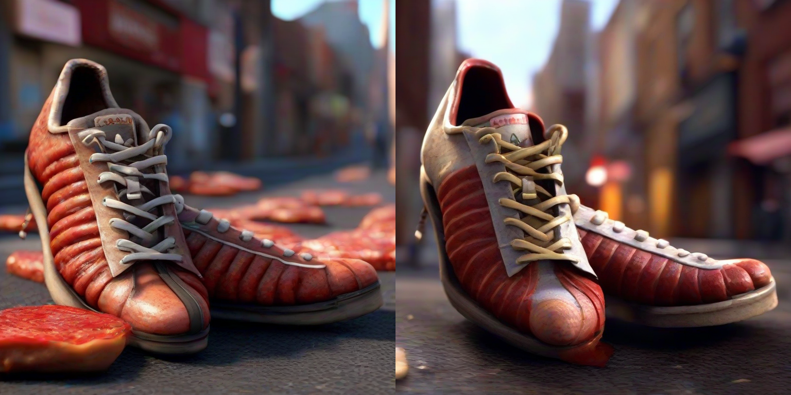
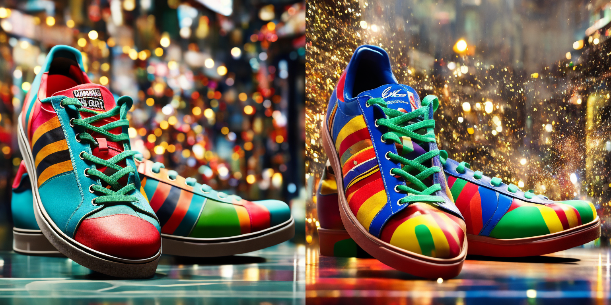

# ControlNet-XS


These are ControlNet-XS weights trained on [stabilityai/stable-diffusion-xl-base-1.0](https://huggingface.co/stabilityai/stable-diffusion-xl-base-1.0) and  [stabilityai/stable-diffusion-2-1](https://huggingface.co/stabilityai/stable-diffusion-2-1) on edge and depthmap conditioning respectively. You can find more details and further visual examples on the project page [ControlNet-XS](https://vislearn.github.io/ControlNet-XS/).

## The codebase
The code is based on on the StableDiffusion frameworks. To use the ControlNet-XS, you need to access the weights for the StableDiffusion version that you want to control separately.
We provide the weights with both depth and edge control for StableDiffusion2.1 and StableDiffusion-XL at Huggingface
- [ControlNet-XS](https://huggingface.co/CVL-Heidelberg/ControlNet-XS)

After obtaining the weights, you need the complete the config files with the paths to the checkpoints of the StableDiffusion base and ControlNet-XS.

#### 1. Setting up the virtualenv

This is assuming you have navigated to the `ControlNet-XS` root after cloning it.


**PyTorch 1.13**

```shell
# install required packages from pypi
python3 -m venv .pt13
source .pt13/bin/activate
pip3 install -r requirements/pt13.txt
```

**PyTorch 2.0**


```shell
# install required packages from pypi
python3 -m venv .pt2
source .pt2/bin/activate
pip3 install -r requirements/pt2.txt
```


#### 3. Install `sgm`

```shell
pip3 install .
```


## Usage


Example for StableDiffusion-XL with Canny Edges

```python
import scripts.control_utils as cu
import torch
from PIL import Image

path_to_config = 'ControlNet-XS-main/configs/inference/sdxl/sdxl_encD_canny_48m.yaml'
model = cu.create_model(path_to_config).to('cuda')

image_path = 'PATH/TO/IMAGES/Shoe.png'

canny_high_th = 250
canny_low_th = 100
size = 768
num_samples=2

image = cu.get_image(image_path, size=size)
edges = cu.get_canny_edges(image, low_th=canny_low_th, high_th=canny_high_th)

samples, controls = cu.get_sdxl_sample(
    guidance=edges,
    ddim_steps=10,
    num_samples=num_samples,
    model=model,
    shape=[4, size // 8, size // 8],
    control_scale=0.95,
    prompt='cinematic, shoe in the streets, made from meat, photorealistic shoe, highly detailed',
    n_prompt='lowres, bad anatomy, worst quality, low quality',
)


Image.fromarray(cu.create_image_grid(samples)).save('SDXL_MyShoe.png')
```


Example for StableDiffuion2.1 with depth maps


```python
import scripts.control_utils as cu
import torch
from PIL import Image

path_to_config = 'PATH/TO/CONFIG/sd21_encD_depth_14m.yaml'
model = cu.create_model(path_to_config).to('cuda')

size = 768
image_path = 'PATH/TO/IMAGES/Shoe.png'


image = cu.get_image(image_path, size=size)
depth = cu.get_midas_depth(image, max_resolution=size)
num_samples = 2

samples, controls = cu.get_sd_sample(
    guidance=depth,
    ddim_steps=10,
    num_samples=num_samples,
    model=model,
    shape=[4, size // 8, size // 8],
    control_scale=0.95,
    prompt='cinematic, advertising shot, shoe in a city street, photorealistic shoe, colourful, highly detailed',
    n_prompt='low quality, bad quality, sketches'
)


Image.fromarray(cu.create_image_grid(samples)).save('SD_MyShoe.png')
```

